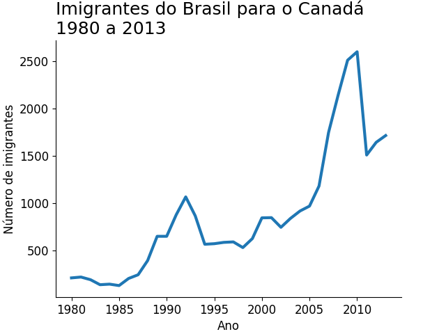

# Análise de Imigrantes do Brasil para o Canadá



---

## Sobre o projeto

Este projeto tem como objetivo analisar a evolução do número de imigrantes brasileiros para o Canadá ao longo do tempo, utilizando dados históricos no período de 1980 a 2013.

A análise foi desenvolvida com foco na identificação de tendências e padrões no fluxo migratório, aplicando técnicas de manipulação, tratamento e visualização de dados com Python.

O projeto faz parte do meu desenvolvimento na área de Análise de Dados, com ênfase em:

* Manipulação de dados com Pandas
* Limpeza e organização de dados
* Análise de séries temporais
* Visualização de dados com Matplotlib

---

## Metodologia

O projeto foi desenvolvido seguindo as seguintes etapas:

1. Leitura dos dados a partir de um arquivo CSV
2. Tratamento e organização dos dados com Pandas
3. Definição do índice para facilitar consultas por país
4. Extração da série temporal referente ao Brasil
5. Estruturação dos dados para visualização
6. Construção de gráfico de linha com Matplotlib

---

## Insights iniciais

A análise dos dados permite observar:

* Tendência de crescimento no fluxo migratório ao longo das décadas
* Aceleração significativa a partir dos anos 2000
* Pico de imigração por volta de 2010
* Indícios de volatilidade após o período de crescimento

Esses comportamentos podem estar associados a fatores econômicos globais, políticas migratórias e oportunidades de trabalho no exterior.

---

## Tecnologias utilizadas

* Python
* Pandas
* Matplotlib

---

## Estrutura do projeto

```
analise-imigrantes-brasileiros/
│
├── imagens/
│   └── imigrantes.png
│
├── analise_imigrantes_brasileiros.ipynb
├── imigrantes_canada.csv
├── requirements.txt
└── README.md
```

---

## Como executar o projeto

Clone o repositório:

```bash
git clone https://github.com/FilipeMadeira13/analise-imigrantes-brasileiros
```

Acesse o diretório:

```bash
cd analise-imigrantes-brasileiros
```

Crie um ambiente virtual:

```bash
python3 -m venv .venv
```

Ative o ambiente:

```bash
source .venv/bin/activate  # Linux/Mac
.venv\Scripts\activate     # Windows
```

Instale as dependências:

```bash
pip install -r requirements.txt
```

Execute o notebook:

```bash
jupyter notebook
```

---

## Fonte dos dados

Os dados utilizados representam o número de imigrantes brasileiros no Canadá ao longo dos anos, organizados em formato de série temporal.

---

## Possíveis melhorias

* Análise comparativa com outros países
* Aplicação de estatísticas descritivas
* Criação de dashboards interativos (ex: Streamlit)
* Integração com fontes de dados atualizadas

---

## Aprendizados

Durante o desenvolvimento deste projeto, foram reforçados conceitos como:

* Manipulação e transformação de dados
* Organização de dados para análise
* Construção de visualizações claras e objetivas
* Interpretação de tendências em séries temporais

---

## Autor

* Filipe Madeira
* https://github.com/FilipeMadeira13
